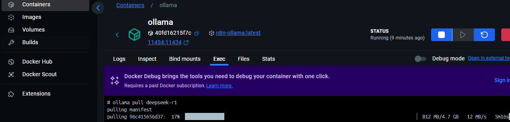
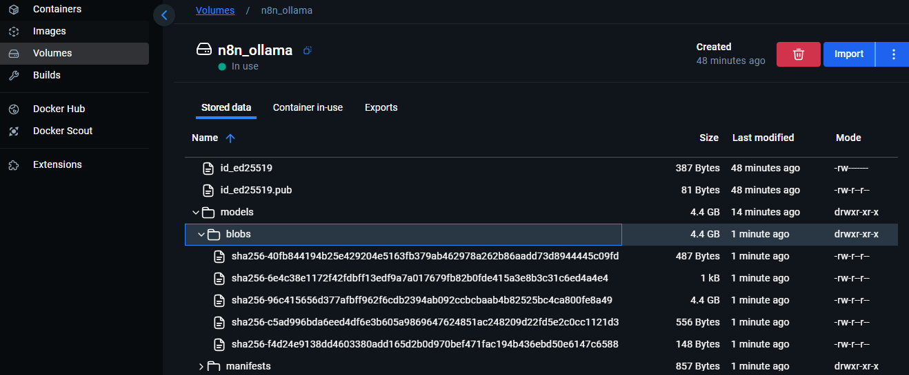
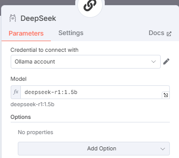
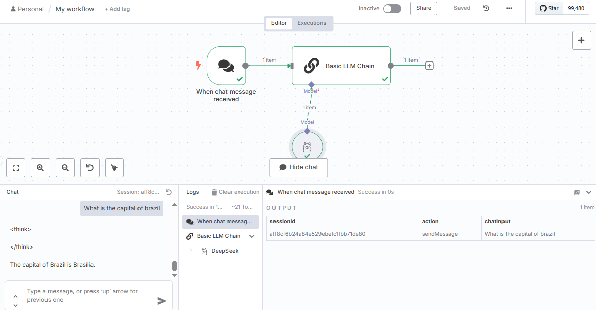

# Configure

## 1 - Run docker compose up

pull deepseek so n8n can understand model

## 2 - ollama pull deepseek-r1

Now, you should be able to see the model in docker volume

# n8n

Access n8n workflow local website:

http://localhost:5678/

Create a new workflow:
- Add "Chat Trigger node"
- Add "AI Agent"
- Add "Ollama Chat Model"

## Configure Ollama Chat Model

Configure and test connection.

http://ollama:11434/

If you did step 2 [ollama pull deepseek-r1], n8n should contain deepseek-r1 in the list of models

## Run flow 

Add a question/message in chat

## Reference:

https://github.com/n8n-io/self-hosted-ai-starter-kit