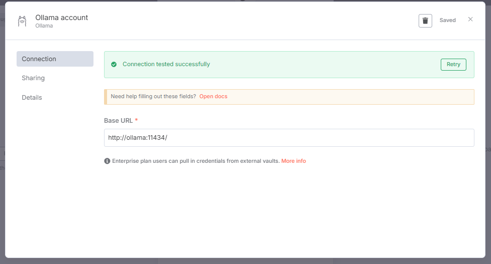

# Configure

run docker compose up

download ollama

https://ollama.com/download/windows

download deepseek so n8n can understand model

ollama run deepseek-r1:1.5b

# n8n

http://localhost:5678/

add ollama chat model

http://ollama:11434/

